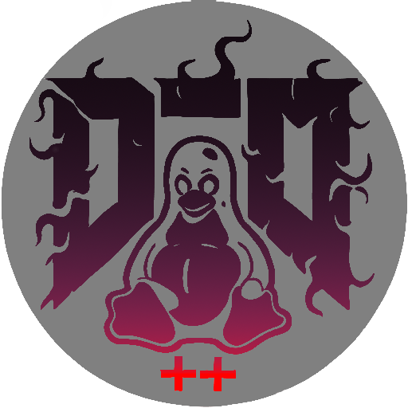

# CPP Doom
[](https://github.com/CoryM/cpp-doom)

[](https://github.com/CoryM/cpp-doom) [](https://github.com/CoryM/cpp-doom) [](https://github.com/CoryM/cpp-doom/blob/master/COPYING.md) [](https://github.com/CoryM/cpp-doom/commits/master)

CPP Doom is fork and a conversion of Crispy Doom writen in C to C++23 or later.  This is a "PET" project and may be removed or deleted at anytime.  The idea is to learn how to refactor C code into modern C++ and try to use C++23 features and eventualy latter C++ stadards as C++26, etc.  MS Windows and Mac OS is no longer supported, currently this is a Linux only build and the extra build complexty will eventualy be removed. 

## Objectives and features

CPP Doom is a source port that aims to provide a learning experence in C++ and reworking a larg-ish codebase.  

Its core goals are:

 * Convert all games and setup utility to C++ that has no Error's or warnings.
 * The games with orginal WAD files should play as Orginaly intended NOT including bugs.
 * Rework all memory unsafe code.


### New controls (with default bindings)

 * Move Forward (alt.) <kbd>W</kbd>
 * Move Backward (alt.) <kbd>S</kbd>
 * Strafe Left (alt.) <kbd>A</kbd>
 * Strafe Right (alt.) <kbd>D</kbd>
 * Jump (bindable to joystick and mouse buttons as well) <kbd>/</kbd> (as in Hexen and Strife)
 * Quick Reverse (bindable to mouse buttons as well)
 * Mouse Look (bindable to mouse buttons or permanent)
 * Look up (bindable to joystick axes as well) <kbd>PgDn</kbd> (as in Heretic)
 * Look down (bindable to joystick axes as well) <kbd>Del</kbd> (as in Heretic)
 * Center view <kbd>End</kbd> (as in Heretic)
 * Toggle always run <kbd>&#8682;</kbd>
 * Toggle vertical mouse movement (new in 5.4)
 * Delete savegame <kbd>Del</kbd>
 * Go to next level
 * Reload current level
 * Save a clean screenshot
 * Toggle Automap overlay mode <kbd>O</kbd>
 * Toggle Automap rotate mode <kbd>R</kbd>
 * Resurrect from savegame (single player mode only) "Run" + "Use"

### Command line parameters

 * `-dm3` specifies the Deathmatch 3.0 rules (weapons stay, items respawn) for netgames (since 4.1).
 * `-episode 1` launches Hell on Earth and `-episode 2` launches No Rest for the Living episode if the Doom 2 IWAD shipped with the Doom 3: BFG Edition is used.
 * `-warp 1a` warps to the secret level E1M10: Sewers of XBox Doom IWAD (since 2.3).
 * `-mergedump <file>` merges the PWAD file(s) given on the command line with the IWAD file and writes the resulting data into the `<file>` given as argument. May be considered as a replacement for the `DEUSF.EXE` tool (since 2.3).
 * `-lumpdump` dumps raw content of a lump into a file (since 5.7).
 * `-blockmap` forces a (re-)building of the BLOCKMAP lumps for loaded maps (since 2.3).
 * `-playdemo demoname -warp N` plays back fast-forward up to the requested map (since 3.0).
 * `-loadgame N -record demoname` and `-loadgame N -playdemo demoname` allow to record and play demos starting from a savegame instead of the level start (since 4.0).
 * `-playdemo demoname1 -record demoname2` plays back fast-forward until the end of demoname1 and continues recording as demoname2 (new in 5.5).
 * `-fliplevels` loads mirrored versions of the maps (this was the default on April 1st up to version 5.0).
 * `-flipweapons` flips the player's weapons (new in 5.3).

### New cheat codes

 * `TNTWEAP` followed by a weapon number gives or removes this weapon (8 = Chainsaw, 9 = SSG). `TNTWEAP0` takes away all weapons and ammo except for the pistol and 50 bullets. Try to load Doom 1 with `DOOM2.WAD` as a PWAD and type `TNTWEAP9` to play the SSG in Doom 1.
 * `TNTEM`, `KILLEM` or `FHHALL` kill all monsters on the current map (and disables all cube spitters).
 * `SPECHITS` triggers all [Linedef actions](https://doomwiki.org/wiki/Linedef_type) on a map at once, no matter if they are enabled by pushing, walking over or shooting or whether they require a key or not. It also triggers all boss monster and Commander Keen actions if possible.
 * `NOTARGET` or `FHSHH` toggle deaf and blind monsters that do not act until attacked.
 * `TNTHOM` toggles the flashing [HOM](https://doomwiki.org/wiki/Hall_of_mirrors_effect) indicator (disabled by default).
 * `SHOWFPS` or `IDRATE` toggle printing the FPS in the upper right corner.
 * `NOMOMENTUM` toggles a debug aid for pixel-perfect positioning on a map (not recommended to use in-game).
 * `GOOBERS` triggers an easter egg, i.e. an "homage to an old friend". ;-)
 * `IDBEHOLD0` disables all currently active power-ups (since 2.2).
 * `IDCLEV00` restarts the current level (since 2.0).
 * `IDMUS00` restarts the current music (new in 5.1).
 * `VERSION` shows the engine version, build date and SDL version (new in 5.1).
 * `SKILL` shows the current skill level (new in 5.5.2).

## Download

CPP-Doom compiled binary's are currently not provided.


### Sources
It can be [downloaded in either ZIP or TAR.GZ format](https://github.com/CoryM/cpp-doom/releases) or cloned via

```
 git clone https://github.com/CoryM/cpp-doom.git
```

Compilation on nix systems should be as simple as

```
 nix-shell
 cd build
 cmake -S .. -G Ninja
 ninja 
```

After successful compilation the resulting binaries can be found in the `build/src/` directory.

## Legalese

Doom is © 1993-1996 Id Software, Inc.; 
Boom 2.02 is © 1999 id Software, Chi Hoang, Lee Killough, Jim Flynn, Rand Phares, Ty Halderman;
PrBoom+ is © 1999 id Software, Chi Hoang, Lee Killough, Jim Flynn, Rand Phares, Ty Halderman,
© 1999-2000 Jess Haas, Nicolas Kalkhof, Colin Phipps, Florian Schulze,
© 2005-2006 Florian Schulze, Colin Phipps, Neil Stevens, Andrey Budko;
Chocolate Doom is © 1993-1996 Id Software, Inc., © 2005 Simon Howard; 
Chocolate Hexen is © 1993-1996 Id Software, Inc., © 1993-2008 Raven Software, © 2008 Simon Howard;
Strawberry Doom is © 1993-1996 Id Software, Inc., © 2005 Simon Howard, © 2008-2010 GhostlyDeath; 
Crispy Doom is additionally © 2014-2019 Fabian Greffrath;
all of the above are released under the [GPL-2+](https://www.gnu.org/licenses/gpl-2.0.html).

SDL 2.0, SDL_mixer 2.0 and SDL_net 2.0 are © 1997-2016 Sam Lantinga and are released under the [zlib license](http://www.gzip.org/zlib/zlib_license.html).

Secret Rabbit Code (libsamplerate) is © 2002-2011 Erik de Castro Lopo and is released under the [GPL-2+](http://www.gnu.org/licenses/gpl-2.0.html).
Libpng is © 1998-2014 Glenn Randers-Pehrson, © 1996-1997 Andreas Dilger, © 1995-1996 Guy Eric Schalnat, Group 42, Inc. and is released under the [libpng license](http://www.libpng.org/pub/png/src/libpng-LICENSE.txt).
Zlib is © 1995-2013 Jean-loup Gailly and Mark Adler and is released under the [zlib license](http://www.zlib.net/zlib_license.html).

The Crispy Doom icon (as shown at the top of this page) is composed of the [Chocolate Doom icon](https://www.chocolate-doom.org/wiki/images/7/77/Chocolate-logo.png) and a [photo](https://en.wikipedia.org/wiki/File:Potato-Chips.jpg) of potato crisps (Utz-brand, grandma's kettle-cooked style) by [Evan-Amos](https://commons.wikimedia.org/wiki/User:Evan-Amos) who kindly released it into the [public domain](https://en.wikipedia.org/wiki/Public_domain). The current high-resolution version of this icon has been contributed by JNechaevsky (formerly by Zodomaniac).
